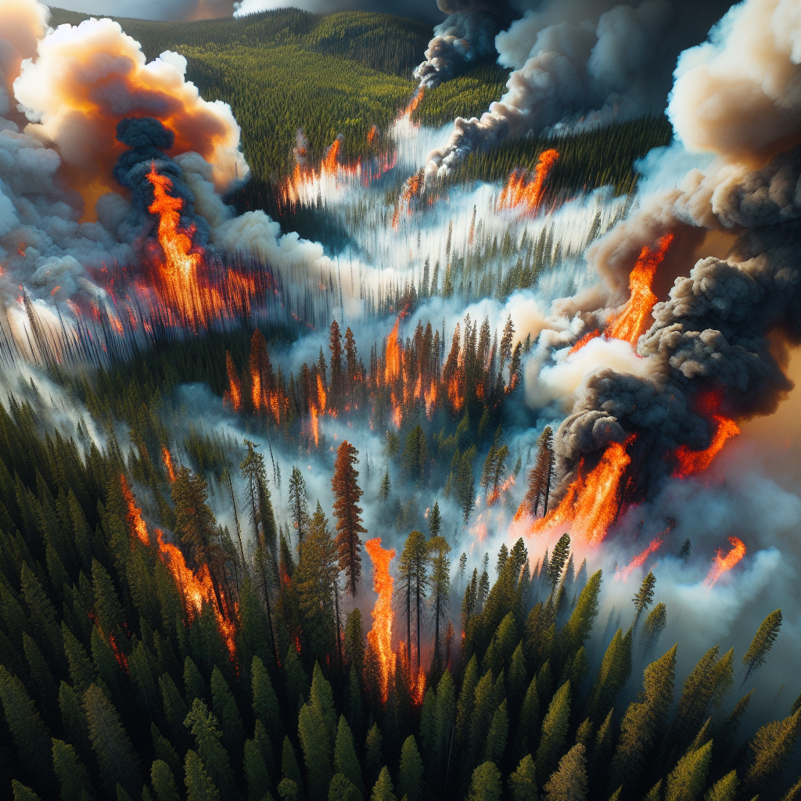

# WildfireCatch - An AI Driven Wildfire Detection and Response System



## Data set Link - https://www.kaggle.com/datasets/abdelghaniaaba/wildfire-prediction-dataset

## Google colab - https://github.com/Rajesh-1234567/WildfireCath-AI-Driven-Wildfire-Detection-and-Response-System

Certainly! Here's an expanded section in the README focusing on the benefits, positive impacts, and how WildfireCatch can help:

---

# WildfireCatch: AI-Driven Wildfire Detection and Response System

## Table of Contents
1. [Project Overview](#project-overview)
2. [Features](#features)
3. [Technologies Used](#technologies-used)
4. [Usage](#usage)
5. [Benefits and Positive Impacts](#benefits-and-positive-impacts)
6. [Contributing](#contributing)
7. [Acknowledgements](#acknowledgements)

## Project Overview

WildfireCatch is an AI-driven wildfire detection and response system designed to identify wildfires in real-time using machine learning models trained on geospatial remote sensing images. This project integrates various technologies to provide features such as real-time notifications, fire spread prediction, dynamic mapping, safety tips through a chatbot, and coordination with drones for enhanced accuracy.

## Features

- **Real-time Wildfire Detection**: Utilizes machine learning models to detect wildfires from satellite imagery.
- **Fire Spread Prediction**: Predicts the potential spread of detected wildfires.
- **Dynamic Mapping**: Provides real-time maps highlighting affected areas.
- **Safety Tips and Disaster Management**: Integrated chatbot using Gemini Pro to offer safety tips and disaster management guidelines.
- **Drone Coordination**: Enhances detection accuracy through drone integration.
- **Notification System**: Sends real-time alerts and updates to users.

## Technologies Used

- **WildfireCatch - Wildfire Detection and Response System**:
  - **Frontend**: HTML, CSS, JavaScript, Bootstrap
  - **Backend**: Django, MapTiler API, Leaflet.js
  - **Machine Learning**: TensorFlow, Python
  - **Database**: SQLite
  - **Deployment**: Azure

Implemented a real-time wildfire detection system using TensorFlow and Python for machine learning model development, integrated with geospatial remote sensing images. Utilized HTML, CSS, JavaScript, Bootstrap, Django, MapTiler API, and Leaflet.js for frontend and backend development, enabling dynamic mapping and visual representation of fire locations and safety zones. Integrated SQLite for database management and deployed the system on Azure.

## Usage

1. **Data Preparation:**
    Ensure you have the necessary datasets. The project uses satellite imagery and other geospatial data available on Kaggle.

2. **Training the Model:**
    Train the machine learning model using the provided notebooks. Adjust hyperparameters as needed.

3. **Running the Application:**
    - **Local Setup:**
      ```bash
      python manage.py runserver
      ```
    - **Google Colab:**
      Upload the notebook to Google Colab and run the cells to start the application.

4. **Using the Chatbot:**
    Access the chatbot through the provided interface to get real-time safety tips and disaster management guidelines.

## Benefits and Positive Impacts

WildfireCatch aims to mitigate the devastating effects of wildfires through proactive detection and effective response mechanisms. Here are some of the key benefits and positive impacts:

- **Early Detection**: Detects wildfires in their early stages, allowing authorities to respond swiftly and minimize damage.
- **Accurate Prediction**: Predicts the spread of wildfires, enabling better resource allocation and evacuation planning.
- **Enhanced Safety**: Provides real-time safety tips and disaster management guidelines through the integrated chatbot, ensuring public awareness and preparedness.
- **Environmental Conservation**: Helps in the conservation of natural habitats by reducing the extent of wildfires through early intervention.
- **Community Resilience**: Empowers communities with tools and information to protect lives and property during wildfire events.
- **Technological Innovation**: Showcases the potential of AI and machine learning in addressing environmental challenges and enhancing public safety.

WildfireCatch not only serves as a tool for emergency response but also promotes sustainable development practices by leveraging advanced technologies for environmental conservation and community resilience.

## Contributing

We welcome contributions to WildfireCatch! If you would like to contribute, please follow these steps:

1. Fork the repository
2. Create a new branch (`git checkout -b feature/your-feature`)
3. Make your changes
4. Commit your changes (`git commit -m 'Add some feature'`)
5. Push to the branch (`git push origin feature/your-feature`)
6. Open a Pull Request

## Acknowledgements

- Thanks to [Kaggle](https://www.kaggle.com/) for providing the datasets used in this project.
- Special thanks to the developers of the libraries and frameworks used in this project.

---

This README section now emphasizes the positive impacts and benefits of WildfireCatch, demonstrating its role in early detection, community safety, environmental conservation, and technological innovation. Adjustments can be made based on further project details or specific goals.
